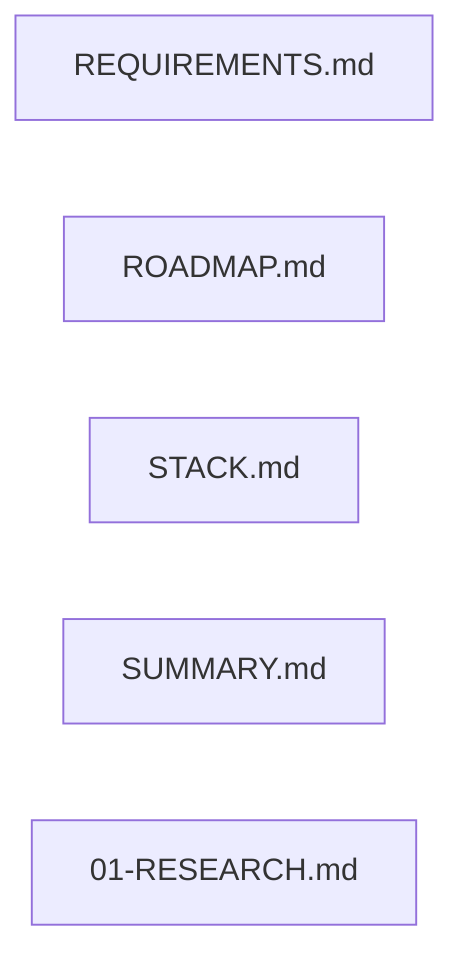

# 实现计划

## Wave 1（并行，无依赖）

- [x] task-01: REQUIREMENTS.md 新增 DATA-05 + 重写 PRED-03 + 修正 SIM-02
- [x] task-02: ROADMAP.md Phase 2 目标、成功标准、风险全面中国化
- [x] task-03: STACK.md epftoolbox 降级 + sklearn.Lasso 新增
- [x] task-04: SUMMARY.md 关闭 epftoolbox gap
- [x] task-05: 01-RESEARCH.md 标记 LEAR gap 已解决

## 任务总表

| 编号 | 任务 | Wave | 优先级 | 估时 | 依赖 | 说明 |
|------|------|------|--------|------|------|------|
| task-01 | REQUIREMENTS.md: 新增 DATA-05、重写 PRED-03、修正 SIM-02 | W1 | P0 | 1h | — | 新增中国电价数据需求项 DATA-05，PRED-03 描述从"epftoolbox 预测"改为"sklearn LEAR+epftoolbox 基准对比"，SIM-02 明确中国省间现货规则 |
| task-02 | ROADMAP.md: Phase 2 目标/成功标准/风险全面中国化 | W1 | P0 | 1h | — | 重写 Phase 2 节：目标改为中国电力市场预测与仿真，成功标准全部基于中国数据和省间规则 |
| task-03 | STACK.md: epftoolbox 降级 + sklearn.Lasso 新增 | W1 | P0 | 0.5h | — | epftoolbox 用途从"电价预测"改为"基准数据+评估工具"，新增 sklearn.Linear_model.Lasso 为 LEAR 实现方案 |
| task-04 | SUMMARY.md: 关闭 epftoolbox gap | W1 | P0 | 0.5h | — | "epftoolbox LEAR model reimplementation" gap 标记为已解决，更新 ASSUME 中国配置提及 |
| task-05 | 01-RESEARCH.md: 标记 LEAR gap 已解决 | W1 | P0 | 0.5h | — | 在 Phase 1 调研中标记"epftoolbox LEAR reimplementation"gap 已由 Phase 2 重规划解决 |

## 依赖关系图

## 关键路径

无依赖路径 — 5 个任务完全并行，任何任务可任意顺序执行。最短交付周期 = max(估时) = 1h。

## 全局验收标准

- [x] REQUIREMENTS.md 含 DATA-05，PRED-03 描述改为 sklearn LEAR，SIM-02 提及中国省间规则
- [x] ROADMAP.md Phase 2 目标含"中国电力市场预测与仿真"，成功标准全部中国化
- [x] STACK.md epftoolbox 用途为"基准数据源"，sklearn.Lasso 在预测章节
- [x] SUMMARY.md epftoolbox gap 标记为已解决
- [x] 01-RESEARCH.md 含 LEAR gap 已解决标记
