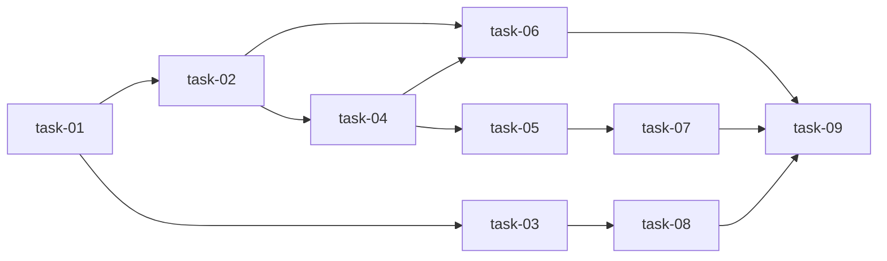

---
author: lmr
created_at: 2026-06-07T02:00:00+08:00
---

# 实现计划: Phase 3 — Trading Agents + Backtesting

## Wave 1（并行，无依赖）
- [x] task-01: 新增依赖 gymnasium, stable-baselines3, shap, tensorboard 到 requirements.txt

## Wave 2（依赖 Wave 1，可并行）
- [x] task-02: 实现 ElectricityMarketEnv (gymnasium.Env) + RewardRegistry + 3 种内置奖励函数
- [x] task-03: 实现 SHAP 可解释性封装（XGBoost TreeExplainer + LEAR LinearExplainer）

## Wave 3（依赖 Wave 2，可并行）
- [x] task-04: 实现 RLAgentFactory + BaseRLAgent (PPO/TD3/SAC 适配器)
- [x] task-08: 编写 Notebook 08 — SHAP 解释

## Wave 4（依赖 Wave 3，可并行）
- [x] task-05: 实现 BacktestRunner + 策略定义 (baseline_persistence, baseline_mean, oracle)
- [x] task-06: 编写 Notebook 06 — 环境走查 + PPO 单算法训练

## Wave 5（依赖 Wave 4）
- [x] task-07: 编写 Notebook 07 — PPO/TD3/SAC 对比 + 回测

## Wave 6（依赖 Wave 5）
- [x] task-09: 端到端验证：回测逻辑正确性 (oracle ≥ all)、全部 import 通过

## 任务总表

| 编号 | 任务 | Wave | 优先级 | 估时 | 依赖 | 说明 |
|------|------|------|--------|------|------|------|
| task-01 | 新增依赖 | W1 | P0 | 0.5h | — | gymnasium≥1.0, sb3≥2.0, shap≥0.46, tensorboard≥2.0 |
| task-02 | ElectricityMarketEnv + RewardRegistry | W2 | P0 | 4h | task-01 | trading_env.py: Reset/step/obs/action/reward |
| task-03 | SHAP 可解释性 | W2 | P1 | 2h | task-01 | shap_explainer.py: waterfall + summary + ranking |
| task-04 | RLAgentFactory + BaseRLAgent | W3 | P0 | 4h | task-01,02 | rl_trainer.py: PPO/TD3/SAC 适配器 |
| task-05 | BacktestRunner + 策略 | W4 | P0 | 4h | task-01,02,04 | backtester.py: replay/compare |
| task-06 | Notebook 06 — 环境走查 + PPO | W4 | P0 | 3h | task-01,02,04 | 环境走查 + PPO 训练 |
| task-07 | Notebook 07 — 多算法对比 + 回测 | W5 | P0 | 4h | task-01,02,04,05 | 三算法对比 + 回测 |
| task-08 | Notebook 08 — SHAP 解释 | W3 | P1 | 3h | task-01,03 | SHAP 解释 |
| task-09 | 端到端验证 | W6 | P0 | 1h | task-06,07,08 | oracle ≥ all, imports |

## 依赖关系图

## 关键路径

task-01 → task-02 → task-04 → task-05 → task-07 → task-09（最长路径 ~17.5h）

## 全局验收标准

- [x] `python -c "from ellectric.pipeline.trading_env import ElectricityMarketEnv; from ellectric.pipeline.rl_trainer import BaseRLAgent; from ellectric.pipeline.backtester import BacktestRunner; from ellectric.pipeline.shap_explainer import explain_xgboost_sample; print('imports OK')"` 无报错（需 pip install deps）
- [x] oracle 策略 P&L ≥ 所有其他策略（逻辑正确性断言）
- [x] 已有 8 个 pipeline 模块未被修改
- [x] 3 个 notebook 在 Jupyter 中打开无错误
- [x] PPO 训练 50K steps 在 30 分钟内完成（CPU）
